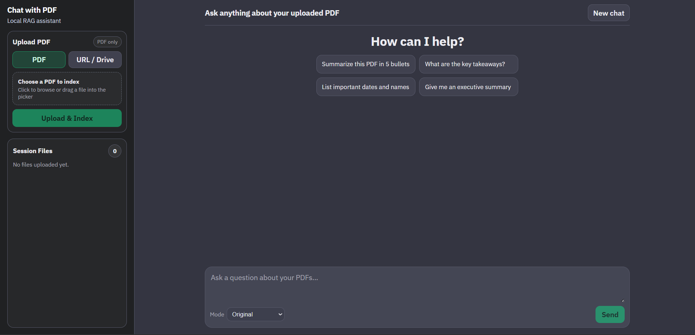
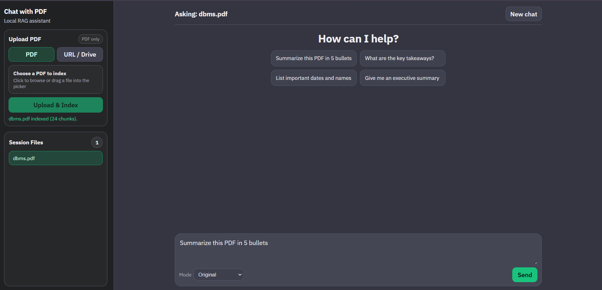
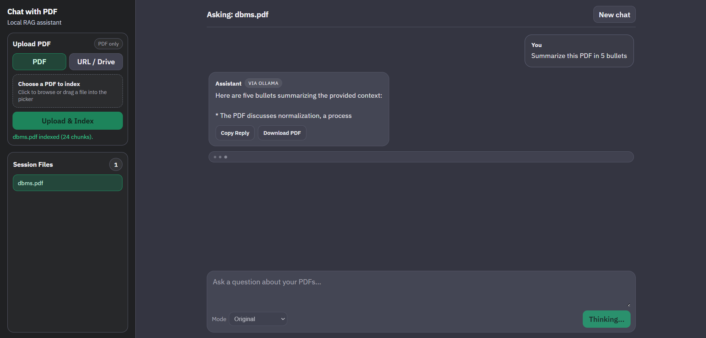
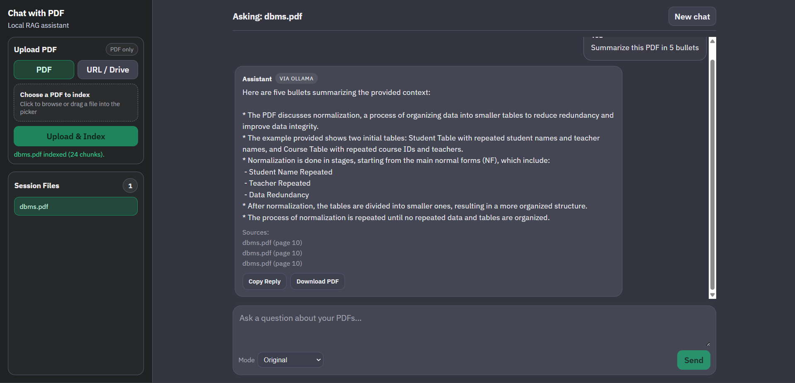

## 📄 Chat with PDF (RAG-Based System)

A full-stack application that allows users to upload one or multiple PDFs and interact 
with their content using a **Retrieval-Augmented Generation (RAG)** pipeline.

---
## 🚀 Features


- 📂 Upload and process multiple PDFs
- 🔍 Semantic search using embeddings
- 💬 Chat with document content
- 🧠 Context-aware responses with chat history
- ⚡ Fast retrieval using FAISS
- 🔄 Reset index functionality
- 🧩 Modular and scalable backend design


---
## 🛠 Tech Stack

**Frontend**
- React (Vite)

**Backend**
- FastAPI

**AI / ML**
- Ollama (LLM)
- SentenceTransformers (Embeddings)
- FAISS (Vector Store)

---

## 📁 Project Structure
```

CHAT_PDF/
│
├── frontend/
│   ├── src/
│   │   ├── components/
│   │   ├── App.jsx
│   │   ├── api.js
│   │   ├── main.jsx
│   │   └── styles.css
│   ├── .env.example
│   ├── index.html
│   ├── package.json
│   └── vite.config.js
│
├── backend/
│   ├── routes/
│   │   ├── ask.py
│   │   └── upload.py
│   ├── services/
│   │   ├── history_service.py
│   │   ├── pdf_service.py
│   │   ├── rag_service.py
│   │   └── vector_store_service.py
│   ├── utils/
│   │   ├── config.py
│   │   └── schemas.py
│   ├── .env.example
│   ├── main.py
│   └── requirements.txt
│
└── README.md

```
---

## ⚙️ Backend Setup

```
cd backend
python -m venv .venv
.venv\Scripts\activate   # Windows
pip install -r requirements.txt
copy .env.example .env


Update `.env`:

OLLAMA_BASE_URL=http://localhost:11434


Pull model:

ollama pull llama3.2:1b


Run backend:

uvicorn main:app --reload --port 8000

```
---

## ⚙️ Backend Configuration

```
INDEX_VERSION=1
EMBEDDING_MODEL=sentence-transformers/all-MiniLM-L6-v2
CHAT_MODEL=llama3.2:1b
OLLAMA_BASE_URL=http://localhost:11434
```
---

## 🔌 API Endpoints

| Method | Endpoint       | Description       |
| ------ | -------------- | ----------------- |
| POST   | `/upload`      | Upload PDF        |
| POST   | `/ask`         | Ask question      |
| POST   | `/reset-index` | Reset FAISS index |
| GET    | `/health`      | Health check      |

---

## 🎨 Frontend Setup

```
cd frontend
npm install
copy .env.example .env
npm run dev

App URL:

http://localhost:5173
```

---

## 🔍 How It Works (RAG Pipeline)

1. Upload PDF → `/upload`
2. Extract text
3. Split into chunks
4. Generate embeddings
5. Store in FAISS
6. Ask question → `/ask`
7. Retrieve relevant chunks
8. Send context + question to LLM
9. Get final answer

---

## ✨ Additional Features

* Multiple PDFs supported
* Session-based chat history
* Index versioning
* Provider info in response
* Streaming answer rendering
* Inline reply actions: copy + PDF export

---

## 🖼 UI Walkthrough (Current)

The latest UI flow includes:

1. Left sidebar for upload and file selection
	- Upload source toggle: `PDF` or `URL / Drive`
	- Single `Upload & Index` action
	- Session file list with active file highlight

2. Main chat area
	- Active file context in header (`Asking: <file>.pdf`)
	- Quick prompts in empty state
	- Streaming assistant responses
	- Per-reply actions under assistant messages:
	  - `Copy Reply`
	  - `Download PDF`

3. Bottom-pinned composer
	- Composer remains at the bottom of the chat viewport
	- Mode selector placed near the send action

### Screenshots

#### Chat Layout


#### Empty / Quick Prompt State



#### Streaming / Thinking State


#### Result


### Demo Video

[Watch Demo (v1)](docs/demo/v1.mp4)

---

## 📦 Storage

* `backend/data/` → FAISS index + PDFs

---

## ⚠️ Notes

* Chat history is in-memory (use Redis/DB for production)
* SSE can be used for streaming
* Update `INDEX_VERSION` when changing embedding model

---

## 📌 Future Improvements

* Streaming responses
* Authentication
* Persistent storage
* UI enhancements
* Deployment support

---

## 🧑‍💻 Author

**Aditya Maurya**

